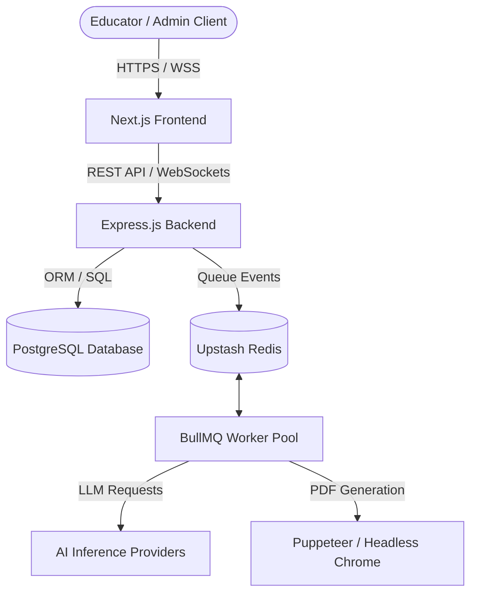

# VedaAI Architecture

VedaAI is a production-grade full-stack AI-powered educational assessment platform. This document outlines the application layers, data flow, repository structure, and key architectural choices.

## 1. System Topology



## 2. Directory Layout

The codebase is organized as an npm workspaces monorepo:

```txt
├── apps/
│   ├── frontend/         # Next.js 16 App Router UI
│   └── backend/          # Express/Prisma API Server & Workers
├── docs/                 # Consolidated documentation
└── package.json          # Workspace configuration
```

## 3. Technology Stack

### Frontend
- **Framework**: Next.js 16 (App Router)
- **State Management**: Zustand 5.x
- **Styling**: TailwindCSS 4.x
- **Micro-Interactions**: Framer Motion
- **Form Handling**: React Hook Form + Zod validation
- **Real-Time Client**: Socket.IO Client

### Backend
- **Runtime**: Node.js 20.x (TypeScript 5.x)
- **Framework**: Express.js 4.x
- **Database ORM**: Prisma Client
- **Background Tasks**: BullMQ 5.x backed by Upstash Redis
- **Real-Time Gateway**: Socket.IO 4.7.x
- **Password Hashing & Cryptography**: Argon2

### Database & Third-Party Services
- **Database**: PostgreSQL (Neon Database)
- **AI Services**: Anthropic (Claude), Nvidia, and Groq API engines
- **Storage Service**: AWS S3 (for document uploads/downloads) or Local Disk
