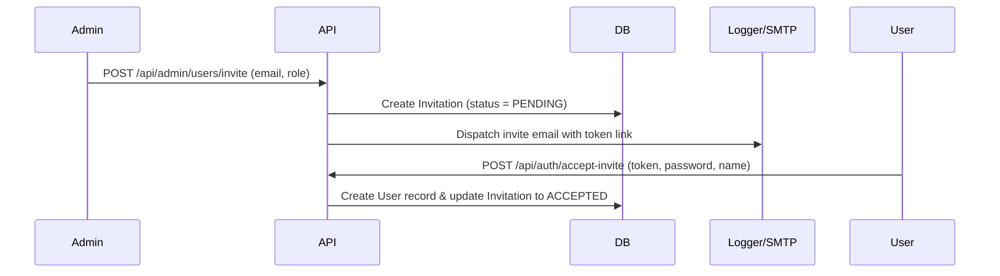

# VedaAI Onboarding Lifecycle

This document describes the onboarding lifecycle for new users (Admins, Teachers, and Students) in the multi-tenant VedaAI SaaS ecosystem.

## 1. Invitation-Based Provisioning

Self-service registration (`/auth/signup`) is disabled for institutional roles. All users are added via the organization invite flow:

## 2. Onboarding Status

Every user record in the database holds a boolean field `hasCompletedOnboarding`.
- When an invited user first sets their password and logs in, they are redirected to a customized setup wizard if `hasCompletedOnboarding === false`.
- For `SUPER_ADMIN` and manually assigned school Admins, this flag defaults to `true`.
- The user cannot bypass dashboard layout restrictions or access classroom features until the onboarding walkthrough is complete and `hasCompletedOnboarding` is set to `true`.
