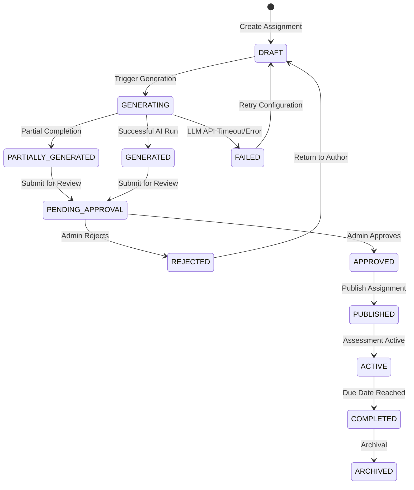

# VedaAI Workflow State Machine

The core value proposition of VedaAI centers around the creation, verification, and publication of educational assessments. This document details the states and valid transitions implemented inside the `workflowEngine`.

## 1. Assignment State Lifecycle

Each `Assignment` entity moves through a strict, deterministic sequence of status codes. Attempted transitions outside of this pathway are rejected by the system.

## 2. Transition Rules

The backend enforces these state transitions programmatically via the `workflowEngine`.

| Current Status | Allowed Next Statuses |
| :--- | :--- |
| `DRAFT` | `GENERATING` |
| `GENERATING` | `GENERATED`, `FAILED`, `PARTIALLY_GENERATED` |
| `PARTIALLY_GENERATED` | `PENDING_APPROVAL` |
| `GENERATED` | `PENDING_APPROVAL` |
| `FAILED` | `DRAFT`, `GENERATING` |
| `PENDING_APPROVAL` | `APPROVED`, `REJECTED` |
| `REJECTED` | `DRAFT` |
| `APPROVED` | `PUBLISHED` |
| `PUBLISHED` | `ACTIVE` |
| `ACTIVE` | `COMPLETED` |
| `COMPLETED` | `ARCHIVED` |
| `ARCHIVED` | None |
